### Посібник по користуванню панеллю адміністратора бази поліцейських ювенальної поліції</h3>

### Українська версія

___

### 0. Насамперед потрібно ознайомитись з базовим функціоналом таблиць.

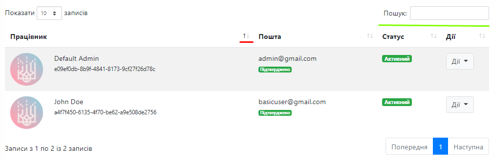

Кнопка виділена червоним дозволяє сортувати всю таблицю за окремим полем по зростанню, або спаданню.

Пошук виділений зеленою лінією шукає зразу по всіх полях таблиці.

___

### 1. Таблиця користувачів

Користувачі є як поліцейськими, так і базовими користувачами. (Тобто мають змогу входити в аккаунт, та адмінуструвати базу, якщо мають для цього ролі у яких є дозволи для адміністрування.

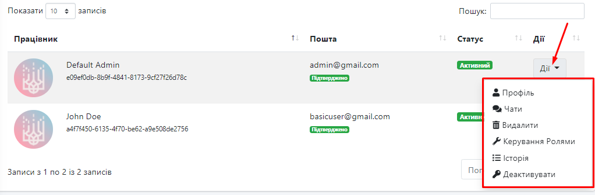

##### Для кожного користувача можна:
* Подивитись профіль та редагувати його.
* Продивитись чати користувача.
* Керувати ролями для користувача.
* Переглянути історію користувача (А саме дії, які він робив в панелі керування).
* Видалити.
* Деактивувати та Активувати (При деактивації користувач не зможе зайти в систему).

___

### 2. Базові ролі

* SuperAdmin - базова роль зі всіма дозволами, користувач з даною роллю має права абсолютно на все. Видавати Ролі має право тільки користувач з даною роллю.
*	Admin - базова роль, яку може налаштовувати користувач з роллю SuperAdmin.
*	Worker - роль яка дається при створенні користувача, не має дозволів. Використовується тільки для працівників, які не будуть редагувати базу. (Тобто для Поліцейських, дані яких підтягує бот).

Також можна створювати ролі та налаштовувати їх.

___

### 3. Дозволи для ролей

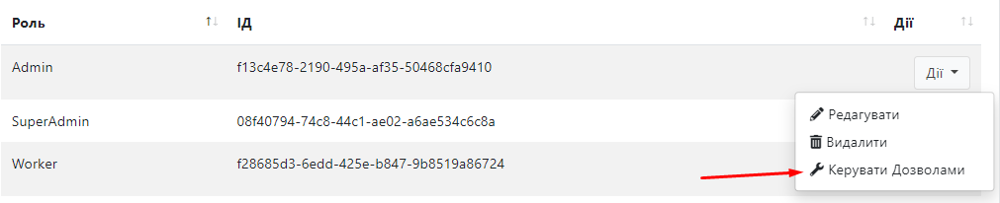

Право налаштовувати дозволи має тільки користувач з роллю SuperAdmin.

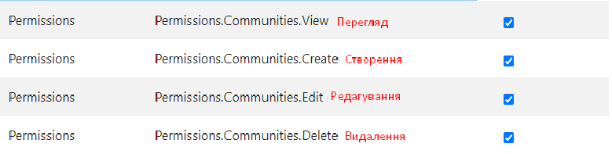

##### Communities (Community) - Громади
##### Users (User) - Користувачі
##### Districts (District) - Райони
##### Roles (Role) - Ролі
##### Permissions (Permission) - Дозволи

___

### 4. Райони

Можна додавати, видаляти та редагувати.

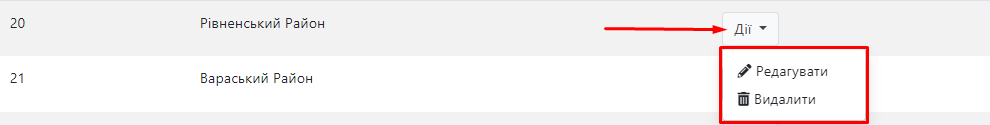

### 5. Громади

Мають зв'язок з таблицею Райони. Можна редагувати, додавати, видаляти, змінювати район. В таблиці також є сортування по районам для зручності (виділено червоним).

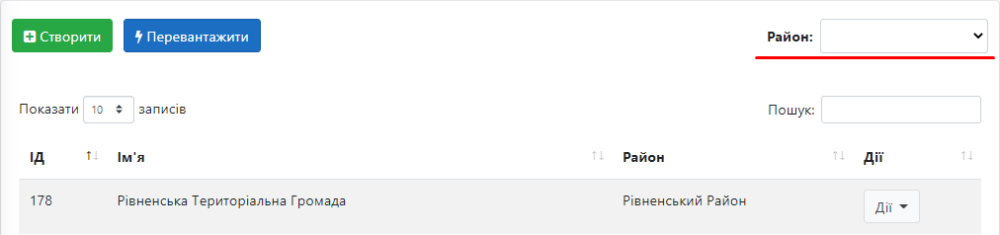

___

### 6. Історія

Зміна будь-якого об'єкта користувачем буде додаватись в історію
При редагуванні виводяться нові та старі значення.

При редагуванні виводяться нові та старі значення.

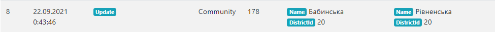

При створенні виводяться лише нові значення

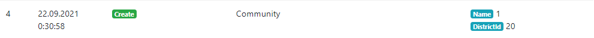

При видаленні випадковому старі значення всерівно запишуться в історію

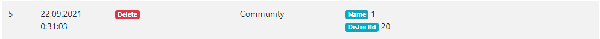

Вхід та вихід користувачів також записується в історію

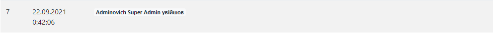

При зміні ролей для користувачів, або ж дозволів для ролей записується старі та нові значення

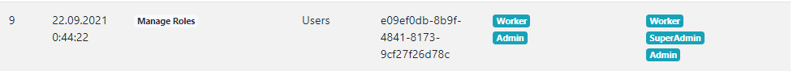
